<!-- _class: lead -->

# Diffondere un progetto Open Hardware

**Il caso di Angelo**

Pascal Brunot - FabLab Bergamo
Linux Day 2025 - Bergamo

---

## Agenda

1. **Introduzione**: Open hardware e Progetto Angelo
2. **Sfide alla replica**: sicurezza, normative, responsabilità
3. **Analisi tecnica**: modellazione, simulazione, verifica
4. **Approccio FabLab Bergamo** per la diffusione
5. **Conclusioni**: lezioni apprese e prossimi passi

---

<!-- _class: lead -->

# Parte 1

Open Source e Open Hardware

---

## Open Source e Open Hardware

**Similitudini:**

- ✅ Licenze permissive (modifiche, distribuzione, uso commerciale)
- ✅ Documentazione completa accessibile pubblicamente
- ✅ Comunità collaborativa
- Diffendere i diritti degli utenti vs. produttori.

---

## Open Source e Open Hardware

**Differenze fondamentali:**

|  | **Open Source (Software)** | **Open Hardware** |
|---------|----------------------|---------------|
| **Natura** | Digitale - copia istantanea | Fisica - fabbricazione necessaria |
| **Costi** | Distribuzione ~gratuita | Materiali e produzione costosi |
| **Competenze** | Programmazione (accessibile online) | Elettronica, saldatura, fab (+ costose) |
| **Protezione IP** | Copyright | Brevetti, design rights |

NB: Il firmware deve essere aperto.

---

## Il processo di fabbricazione PCB

**1. Progettazione con strumenti EDA:**

- **KiCAD** (open source, gratuito)
- **EasyEDA** (proprietario, integrato con JLCPCB) - usato per Angelo

**Workflow completo:**

```
Scelta componenti → Schema elettrico → 
Layout PCB (posizionamento, routing) → File Gerber →
Fabbricazione → Assemblaggio componenti →
Collaudo → Assemblaggio finale
```
---

## File Gerber: lo standard per la produzione PCB

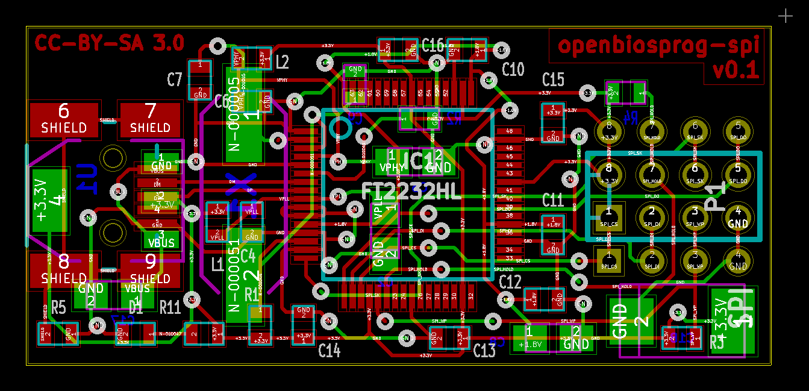

**Cosa sono:**

- Formato universale ASCII vettoriale indipendente dal software CAD
- Standard **RS-274X** - comandi grafici e coordinate XY
- Estensione file: `.gbr`

**Layer principali:**

- **Top/Bottom Copper** - tracce circuito
- **Top/Bottom Silk** - etichette e riferimenti componenti
- **Top/Bottom Mask** - maschera saldatura (protezione)
- **Drill** - posizione e diametro fori
- **Board Outline** - forma del PCB

---

## File Gerber: lo standard per la produzione PCB

**Vantaggi:**

- Interpretati direttamente dalle macchine di produzione
- Nessuna conversione manuale → zero errori
- Compatibilità universale tra produttori

---

## Altri file necessari per la produzione

**Oltre ai Gerber:**

- **Pick & Place (PnP)** - coordinate componenti SMD e orientamento
- **Bill of Materials (BOM)** - lista componenti con codici produttore
- **Assembly drawings** - disegni di assemblaggio (opzionale)
- **Modelli 3D** - per stampa 3D (opzionale)

**Esempio pratico:** [Progetto Fabomatic3 - FabLab Bergamo](https://www.fablabbergamo.it/2024/06/16/fabomatic3/)

---

## Costi di fabbricazione: JLCPCB

**PCB nudi (solo scheda):**

- Prototipo 5 pz (100x100mm, 2 layer): **~2-5 EUR** + spedizione (4 EUR)
- Tempo produzione: 24-48 ore
- Molto economico

**Assemblaggio SMD (PCB + saldatura componenti):**

- Setup fee: ~3-8 USD (una tantum per design)
- Stencil saldatura: 7-10 USD
- Componenti: costo variabile (catalogo JLCPCB con 100k+ componenti)
- Assemblaggio manuale: ~0.008 USD/punto saldatura

---

<!-- _class: lead -->

# Il progetto Open Hardware Angelo

---

## Progetto Open Hardware Angelo

Il progetto Angelo nasce da una necessità reale: permettere ad Angelo, 104 anni e ipoacusico, di comunicare con i suoi cari nonostante le distanze imposte dalla pandemia.

Grazie alla creatività di **Luciano Fumagalli** e al FabLab, è stato sviluppato un amplificatore open, economico e replicabile da chiunque.

Sito ufficiale: <https://angelo-amplifica-emozioni.jimdosite.com>

---

## La storia di Angelo

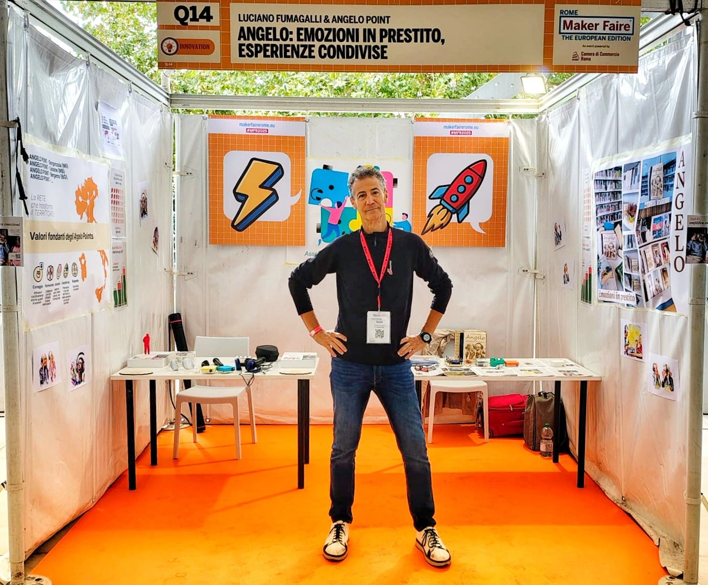

**Maggio 2020 - La sfida**

- Angelo, suocero ipoacusico di 104 anni
- Riapertura RSA dopo lockdown
- Distanziamento sociale
- Labiale offuscato dalle mascherine

**L'idea di Luciano**

- Un amplificatore per amplificare emozioni
- Curiosità e pensiero laterale
- Trovare soluzioni innovative ma frugali

---

## I Magical Helpers: chi ha reso possibile Angelo

**Collaborazioni internazionali:**

- Docenti e ricercatori di Boston (USA)
- Responsabile R&D RSA in Svezia
- Designer italiani in Danimarca
- Maker audiofilo, hub tecnologico, società di packaging
- Artista calligrafico, avvocati per licenza CC BY-SA 4.0

**Make Faire Roma 2024:**

- Finalista sezione "Make to Care"
- Premio "Maker of Merit" agli Elettronici Entusiasti (150.000+ follower)

> "Nella collaborazione divido lo sforzo, addiziono le competenze e moltiplico il risultato"

---

## Il problema dell'ipoacusia


**Dimensioni del problema:**

- Oltre 1,5 miliardi di persone nel mondo soffrono di ipoacusia
- In Italia, oltre il 12% della popolazione (7+ milioni di persone)
- Gli anziani sono i più colpiti

**Barriere esistenti:**

- Reticenza dell'utente o sociali
- Apparecchi acustici tradizionali: centinaia/migliaia di euro
- Accesso limitato in paesi a risorse limitate

---

## Certificazione OSHWA

Open Source Hardware Association - organizzazione internazionale che promuove e certifica l'open hardware.

**Mission:**
> "Promuovere la conoscenza tecnologica e incoraggiare la ricerca accessibile, collaborativa e che rispetta la libertà dell'utente."

**Open Source Hardware Definition v1.0:**

1. **Documentazione** - design files, schemi, layout PCB pubblici
2. **Libertà** - di studiare, modificare, distribuire, fabbricare
3. **Software** - anche firmware e software devono essere open
4. **Formati aperti** - file modificabili (non solo PDF)
5. **No discriminazioni** - uso commerciale permesso
6. **Derivati** - modifiche devono restare open (share-alike)

---

## Certificazione OSHWA

**Non è richiesto:**

- Condividere strumenti di fabbricazione
- Fornire supporto tecnico
- Cedere marchi

---

## Perché certificarsi OSHWA?

**Vantaggi della certificazione:**

- ✅ **Riconoscimento internazionale** del progetto come veramente open
- ✅ **Fiducia** - gli utenti sanno che possono modificare/replicare
- ✅ **Visibilità** - database globale di progetti certificati (>2000 progetti)
- ✅ **Logo OSHWA** - utilizzabile su PCB, documentazione, packaging

**Processo di certificazione:**

- Gratuito e completamente online
- Auto-certificazione con UID univoco
- Community può segnalare non-conformità

---

## La soluzione Angelo diffusa da Luciano

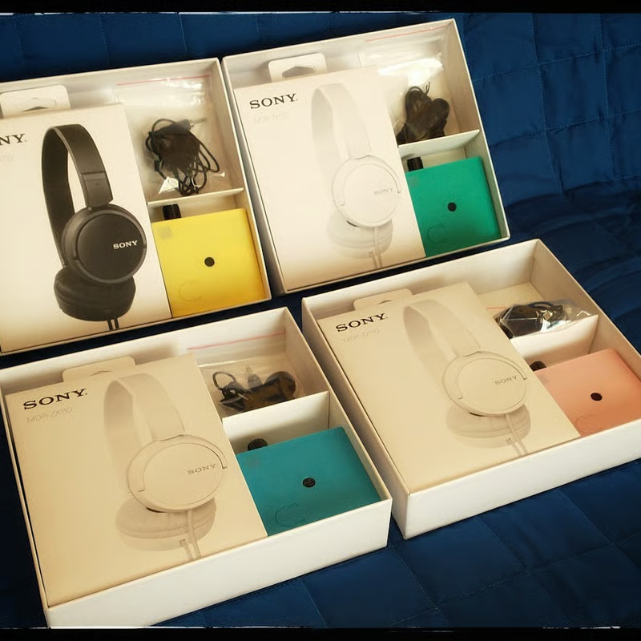

**Caratteristiche tecniche:**

- Custodia stampabile in 3D
- Due versioni: componenti a foro passante (TH) e SMD
- Bill of materials, pick and place file
- Costo componenti: circa 15-20 euro

**Open Hardware come risposta:**

- Documentazione completa e libera
- Replicabile da chiunque con competenze base
- Review del design e bugfixing dalla comunità

---

<!-- _class: lead -->

# Parte 2

## Sfide alla replica del progetto

Cosa comporta diffondere hardware libero?

---

## Barriere pratiche alla replica

**Ostacoli tecnici:**

- Competenze necessarie: elettronica base, saldatura
- Strumenti necessari: saldatore, multimetro, stampante 3D
- Approvvigionamento componenti: AliExpress
- Assemblaggio PCB difficile (versione TH più accessibile)

**Ruolo dei FabLab:**

- Abbassare barriere fornendo strumenti e competenze
- Workshop di assemblaggio guidato
- Supporto tecnico per debugging

---

## Normative, conformità e responsabilità

**Quadro normativo:**

- Il dispositivo **non è un dispositivo medico** certificato
- Non sostituisce apparecchi acustici professionali
- Destinato a uso personale, non commerciale
- Mancanza di marcatura CE e certificazione EU MDR

**Chi è responsabile?**

- **Progettista**: condivide "as-is" con licenza CC-BY-SA 4.0, nessuna garanzia
- **FabLab**: fornisce prototipi, manuale d'uso, verifica il corretto funzionamento
- **Utente finale**: responsabilità dell'uso corretto, deve comprendere limitazioni

---

## Normative, conformità e responsabilità

**Approccio adottato:**

- Diffusione come progetto educativo/DIY (kit) -> FuturaElettronica
- Sperimentazione __prototipale__ con raccolta dei feedback

**Conclusione**

- Quadro attuale piuttosto incerto e non favorevole alla commercializzazione
- Assunzione di responsabilità necessaria dai vari attori coinvolti
- La verifica di conformità CE è necessaria per una maggiore diffusione di Angelo

---

<!-- _class: lead -->

# Parte 3

## Analisi tecnica

доверяй, но проверяй
__fidati, ma verifica__

---

## Sicurezza del dispositivo

**Rischi identificati**

- Rischio elettrico 9V
- Rischi derivanti dall'uso di una batteria
- Alti volumi in uscita (>120dB SPL)
- Feedback acustico (effetto Larsen) se microfono vicino a cuffie

**Necessità di:**

- Analisi tecnica approfondita prima della diffusione
- Validazione dei limiti di sicurezza
- Usare componenti CE (pile, cuffie)

---

## Approccio metodologico

- Modellare teoricamente (funzioni di trasferimento)
- Simulare il sistema e validare con la teoria (LTSpice)
- Misurare il prototipo e validare la simulazione (esperimento)

---

## Schema a blocchi

<div style="display: flex; align-items: center; gap: 2em;">
<div style="flex: 1;">

**Architettura del circuito:**

Ogni stadio è modellato con la propria **funzione di trasferimento** per analizzare:

- **Guadagno** di ogni blocco
- **Risposta in frequenza** complessiva
- **Stabilità** del sistema
- **Interazioni** tra gli stadi

</div>
<div style="flex: 0 0 auto;">

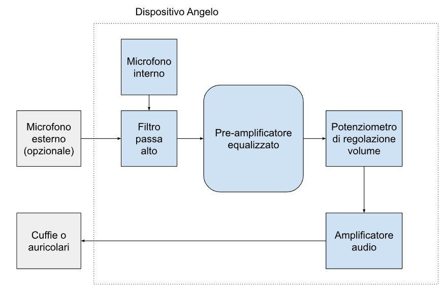

</div>
</div>

---

## Modellazione e simulazione

<div style="display: flex; align-items: flex-start; gap: 2em;">
<div style="flex: 1;">

**Approccio metodologico:**

1. **Modello teorico** - funzioni di trasferimento per ogni stadio
2. **Simulazione LTSPICE** - validazione pressione sonore, Bode
3. **Verifica sperimentale** - misure con oscilloscopio

**Risultati chiave:**

- Guadagno massimo: **49.6 dB a 1.5 kHz** (frequenza del parlato)
- Margine di fase: **130°** → sistema estremamente stabile
- Risposta in frequenza "a banana" - ottimizzata per voce umana
- Accordo eccellente tra teoria, simulazione ed esperimenti

</div>
<div style="flex: 0 0 auto;">

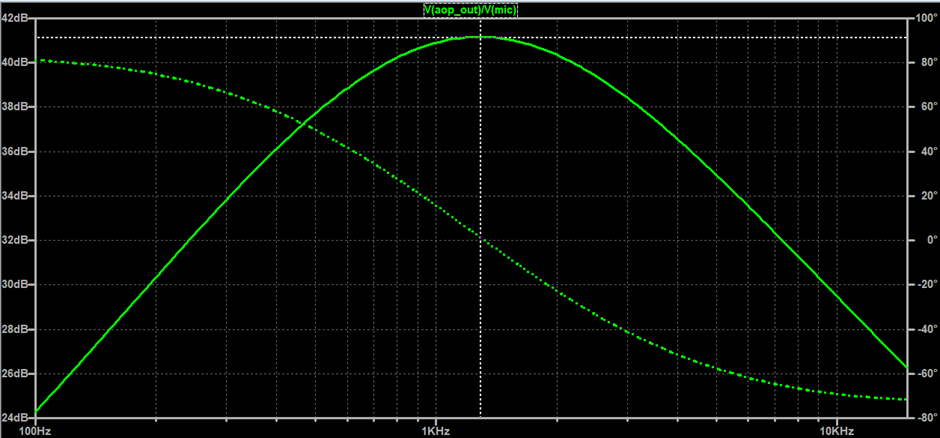

</div>
</div>

---

## Diagramma di Bode

<div style="display: flex; align-items: flex-start; gap: 2em;">
<div style="flex: 1;">

**Analisi in frequenza:**

- **Risposta "a banana"** ottimizzata per voce umana
- Picco a **1.5 kHz** - frequenza fondamentale del parlato
- Attenuazione alle basse e alte frequenze
- **Margine di fase 130°** → stabilità eccellente

**Validazione:**

- Accordo tra modello teorico e simulazione
- Nessuna risonanza o instabilità
- Sistema prevedibile e sicuro

</div>
<div style="flex: 0 0 auto;">

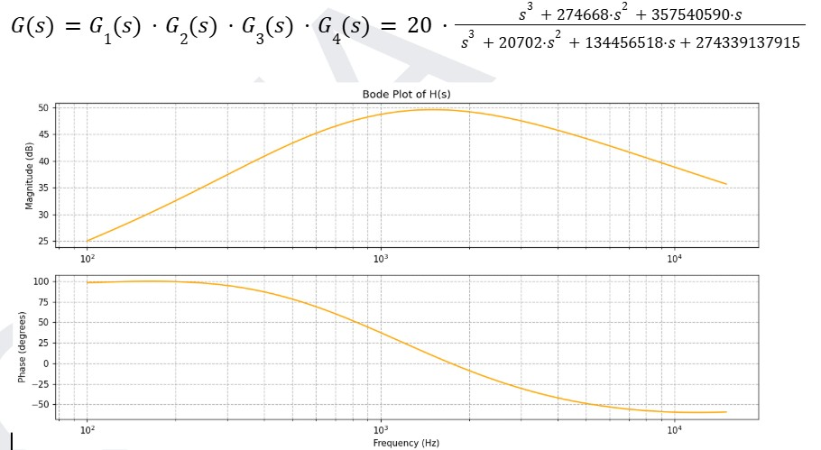

</div>
</div>

---

## Verifica sperimentale

<div style="display: flex; align-items: flex-start; gap: 2em;">
<div style="flex: 1;">

**Test su prototipo FABLAB_0010:**

**1. Consumi elettrici:**

- Media: **12 mA** → autonomia ~54 ore (batteria 650mAh)

**2. Comportamento in saturazione:**

- Volume massimo: **~118 dB SPL** (funzionamento normale)
- Conforme ai datasheet dei componenti

**3. Feedback acustico (Larsen):**

- Caso estremo: microfono a 1cm dalle cuffie
- Può raggiungere 120 dB con cuffie non adatte
- **Requisito critico**: utente deve poter abbassare volume rapidamente

</div>
<div style="flex: 0 0 auto;">

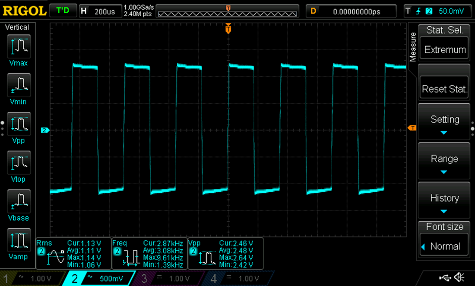

</div>
</div>

---

## Limiti di sicurezza determinati

**Standard di riferimento:**

- Massimo raccomandato: **120 dB SPL** (letteratura ASHA)

**Raccomandazioni per le cuffie:**

- Impedenza: **≥ 24 Ω** (consigliato 32 Ω)
- Sensibilità: **≤ 96 dB**
- Modello testato: Sony MDR-ZX110 (24Ω, 98dB) → **conforme**

**Inserito nel manuale d'uso:**

- Specifiche tecniche cuffie compatibili
- Istruzioni per verifica prima dell'uso
- Disclaimer su rischi e limitazioni

---

<!-- _class: lead -->

# Parte 4

## Approccio FabLab Bergamo

---

## Approccio FabLab Bergamo

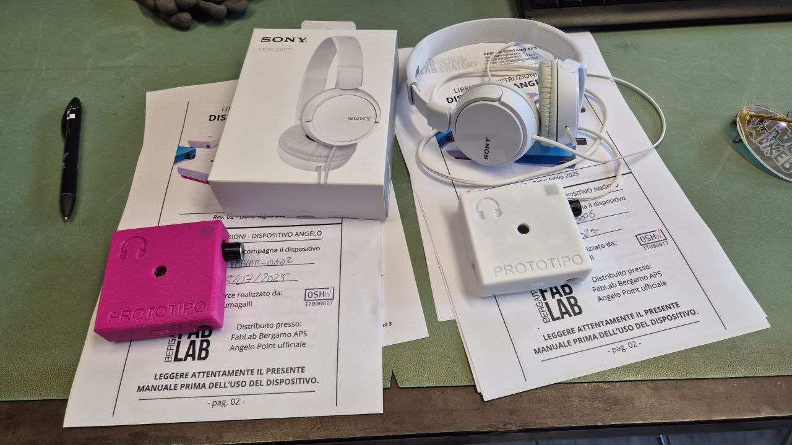

**Obiettivo:**
Diffondere il progetto Angelo in modo **sicuro**, **educativo** e **sostenibile**

**Approccio adottato:**

1. Analisi tecnica (aprile-giugno 2025)
2. Creazione manuale d'uso (giugno 2025)
3. Progetto collaborativo di assemblaggio (aprile 2025- on going)
4. Collaudo dei prototipi
5. Diffusione locale in accomodato d'uso (2 dispositivi)
6. Fabbricazione di 30 dispositivi (novembre 2025)

---

## Arduino Day 2026 - FabLab Bergamo

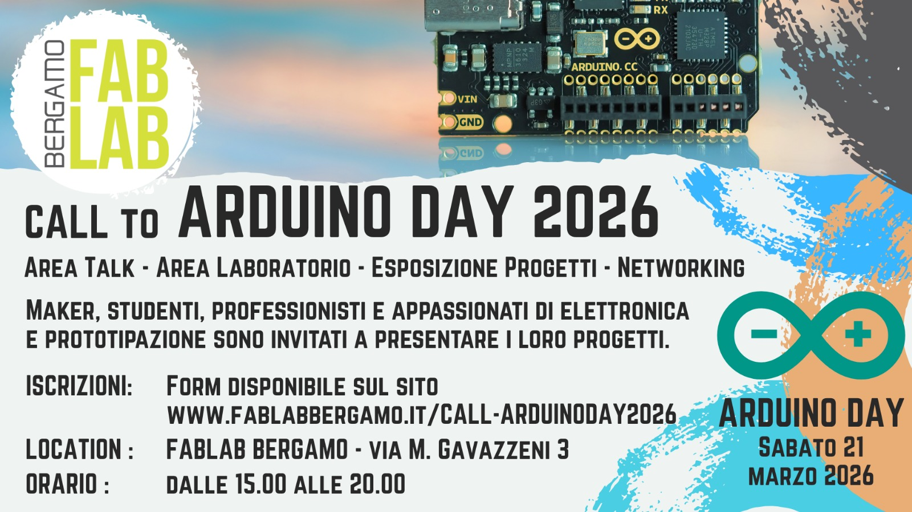

**Prossimo evento:**

- **Data:** Sabato 21 marzo 2026
- **Luogo:** FabLab Bergamo - Via M. Gavazzeni 3
- **Orario:** Dalle 15.00 alle 20.00

**Attività:**

- Area Talk e Area Laboratorio
- Esposizione progetti (Angelo e altri)
- Networking con maker e appassionati

**Partecipa:** Form disponibile su www.fablabbergamo.it/call-arduinoday2026

---

<!-- _class: lead -->

# Conclusioni

---

## Il valore dell'Open Hardware sociale

**Angelo dimostra che:**

- Tecnologia open può risolvere problemi sociali reali
- L'approccio frugale porta ad un costo ridotto (15-20€)
- La comunità può validare e migliorare progetti
- I FabLab sono ponte tra teoria e pratica sul territorio

**Ma servono anche:**

- Rigore ingegneristico nella progettazione in sicurezza
- Gestione responsabile della diffusione

---

**Vieni a trovarci in FabLab**

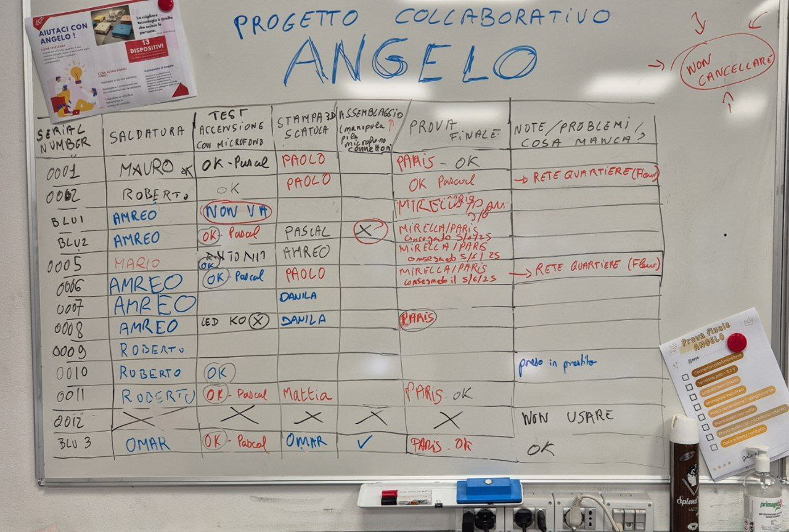

Scopri da vicino:

- Demo del dispositivo Angelo
- Altri progetti Open Hardware
- Strumenti del FabLab (stampanti 3D, laser cutter, elettronica)
- La nostra community

**Le porte sono aperte: la tecnologia è davvero di tutti!**

---

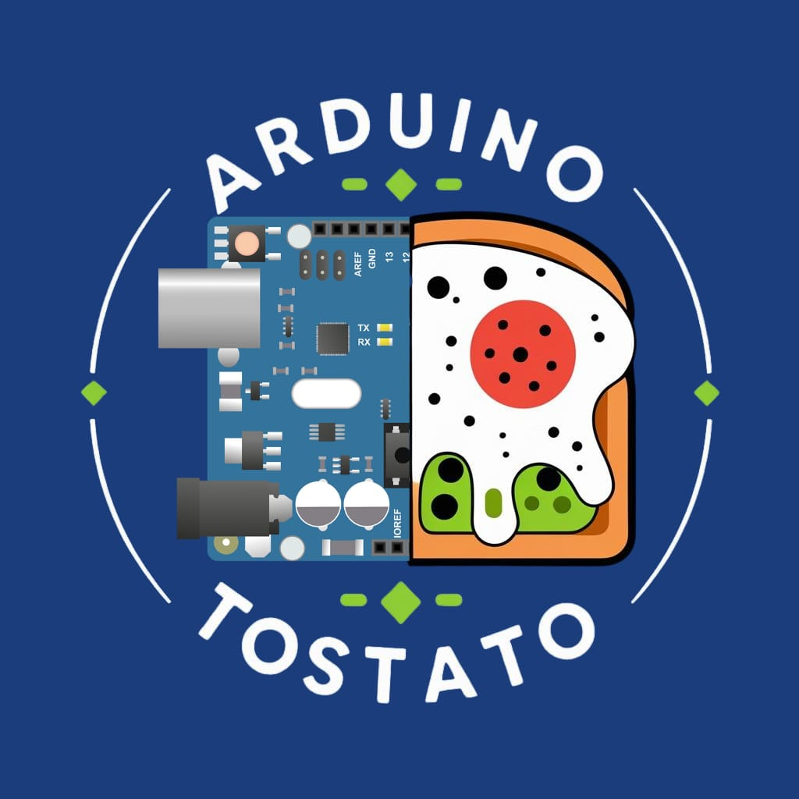

---

<!-- _class: lead -->

# EXTRA

## Miglioramenti possibili

---

## Miglioramento 1: AGC (Automatic Gain Control)

**Problema:**
Volume massimo può raggiungere 120 dB in condizioni estreme

**Soluzione proposta:**

- Circuito AGC con 4 diodi, 3 condensatori, 1 resistenza
- Limita Vout a ~0.6V picco-a-picco
- Riduce SPL massimo di ~18 dB

**Risultati simulazione:**

- Input 50mV → Output 114.9 dB (vs 119.2 dB senza AGC)
- THD: 3.9% (distorsione accettabile)

**Stato:**

- Testato sperimentalmente (SN: FABLAB_0010)
- Funzionante, ma richiede ottimizzazione
- Problemi: oscillazioni a bassa frequenza con alcuni diodi

---

## Miglioramento 2: Protezione inversione polarità

**Problema:**

- Guasti osservati: N°2 Q2 bruciati per inversione polarità batteria
- Esistono due tipi di connettori JH 9V con polarità diverse

**Soluzione implementata:**

- P-MOSFET BS250 o IRF9620 (Rdson < 2Ω)
- Testato ad Agosto 2025 con successo

**Benefici:**

- Protezione completa contro inversione
- Costo aggiunto: ~1 euro

---

## Miglioramento 3: Miniaturizzazione

- PCB 50x40mm (o 115x30mm forma "sigaretta elettronica")
- Batteria integrata longitudinalmente
- Connettori saldati direttamente su PCB

**Vantaggi:**

- Dispositivo tascabile
- Riduzione costi assemblaggio (no cavo batteria)
- Migliore ergonomia

**Stato:**

- Studio di fattibilità completato
- Implementazione futura

---
